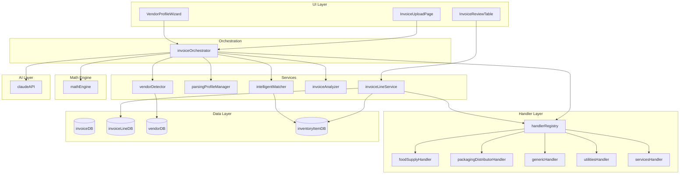
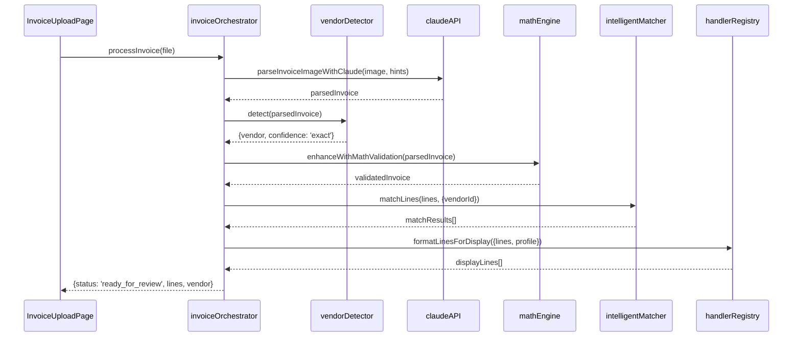
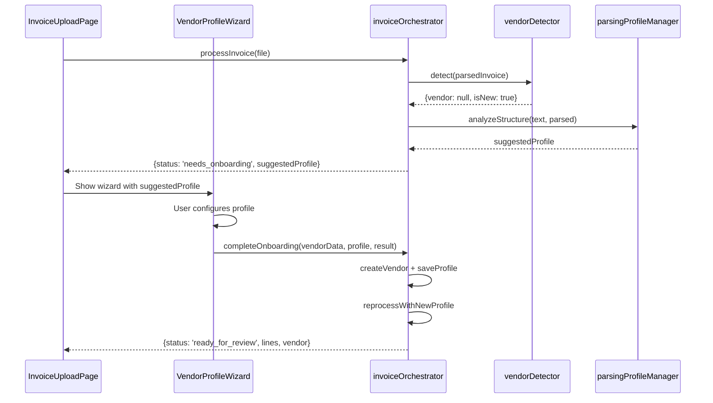
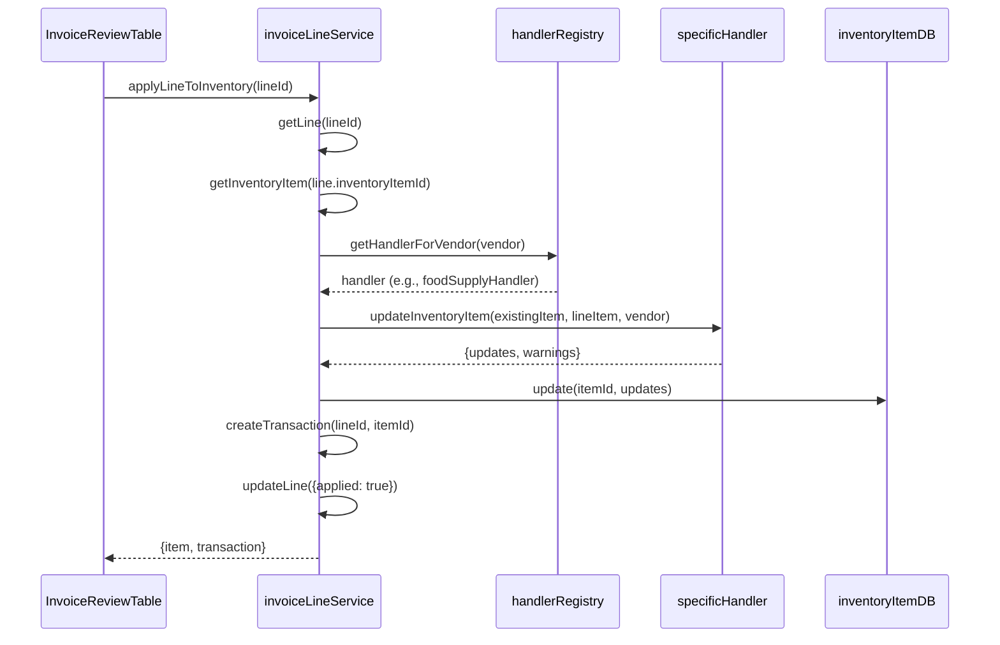
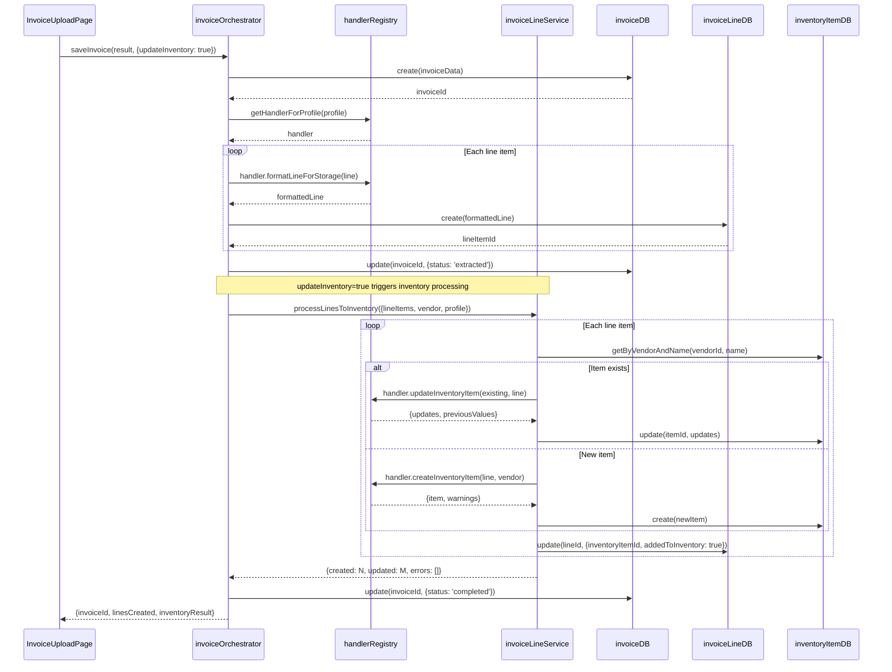

# Invoice Processing System Architecture

**Version:** 2.0
**Last Updated:** 2025-12-30
**Status:** Living Document

---

## Table of Contents

1. [Overview](#overview)
2. [System Components](#system-components)
3. [File Catalog](#file-catalog)
4. [Service Catalog](#service-catalog)
5. [Component Diagram](#component-diagram)
6. [Sequence Diagrams](#sequence-diagrams)
7. [Data Transformations](#data-transformations)
8. [Handler Pattern](#handler-pattern)
9. [Glossary](#glossary)
10. [Cleanup History](#cleanup-history)

---

## Overview

### Purpose

The Invoice Processing System transforms vendor invoice images/PDFs into structured inventory data. It handles:

- **Vision Parsing**: Extract invoice data using Claude Vision API
- **Vendor Matching**: Match vendor by tax number, name, or fuzzy search
- **Intelligent Matching**: Match invoice lines to existing inventory items
- **Inventory Updates**: Apply matched lines to inventory stock/pricing

### Design Philosophy

The system uses a **Strategy Pattern** for invoice type handling:
- Each invoice type (Food Supply, Packaging, Utilities, Services, Generic) has a dedicated handler
- Handlers encapsulate type-specific logic (field mappings, calculations, validations)
- The Vision parser extracts structured JSON; handlers process type-specific fields

### Entry Point

| Entry Point | Used By | Function |
|-------------|---------|----------|
| `processInvoice()` | InvoiceUploadPage | Vision-based PDF parsing |

### Processing Pipeline

| Step | Component | Function |
|------|-----------|----------|
| 1. PDF → Images | `visionParser.js` | Convert PDF pages to PNG images |
| 2. Vision AI | Claude Vision API | Extract structured JSON from images |
| 3. Normalize | `jsonNormalizer.js` | Field aliases + vendor matching |
| 4. Display | `InvoiceUploadPage` | Review and edit extracted data |
| 5. Save | `invoiceLineService.js` | Create invoice + inventory items |

---

## System Components

```
┌─────────────────────────────────────────────────────────────────────┐
│                        PRESENTATION LAYER                           │
│  ┌──────────────────┐ ┌─────────────────────┐                      │
│  │ InvoiceUploadPage│ │ VisionParserTestPage│                      │
│  └────────┬─────────┘ └──────────┬──────────┘                      │
└───────────┼──────────────────────┼──────────────────────────────────┘
            │                      │
            ▼                      ▼
┌─────────────────────────────────────────────────────────────────────┐
│                      VISION PARSER LAYER                            │
│  ┌──────────────────────────────────────────────────────────────┐  │
│  │                    invoice/vision/                            │  │
│  │  • visionParser.js    → PDF → Images → Claude Vision API     │  │
│  │  • jsonNormalizer.js  → Field aliases + vendor matching      │  │
│  │  • index.js           → processInvoice() entry point         │  │
│  └──────────────────────────────────────────────────────────────┘  │
└─────────────────────────────────────────────────────────────────────┘
            │
            ▼
┌─────────────────────────────────────────────────────────────────────┐
│                        SERVICE LAYER                                │
│  ┌────────────────┐ ┌──────────────────┐ ┌────────────────────┐    │
│  │ vendorDetector │ │  lineCategorizer │ │  invoiceAnalyzer   │    │
│  └────────────────┘ └──────────────────┘ └────────────────────┘    │
│  ┌────────────────┐ ┌──────────────────┐                           │
│  │invoiceLineServ │ │invoiceTypeDetect │                           │
│  └────────────────┘ └──────────────────┘                           │
└─────────────────────────────────────────────────────────────────────┘
            │
            ▼
┌─────────────────────────────────────────────────────────────────────┐
│                        HANDLER LAYER                                │
│  ┌──────────────────────────────────────────────────────────────┐  │
│  │                   handlerRegistry.js                          │  │
│  │  getHandler() → Returns correct handler for invoice type      │  │
│  └──────────────────────────────────────────────────────────────┘  │
│       │           │            │           │            │          │
│       ▼           ▼            ▼           ▼            ▼          │
│  ┌─────────┐ ┌─────────┐ ┌─────────┐ ┌─────────┐ ┌──────────┐     │
│  │ Food    │ │Packaging│ │ Generic │ │Utilities│ │ Services │     │
│  │ Supply  │ │Distrib. │ │         │ │         │ │          │     │
│  └─────────┘ └─────────┘ └─────────┘ └─────────┘ └──────────┘     │
└─────────────────────────────────────────────────────────────────────┘
            │
            ▼
┌─────────────────────────────────────────────────────────────────────┐
│                       DATA LAYER                                    │
│  ┌────────────────┐ ┌──────────────────┐ ┌────────────────────┐    │
│  │   invoiceDB    │ │  invoiceLineDB   │ │     vendorDB       │    │
│  └────────────────┘ └──────────────────┘ └────────────────────┘    │
│  ┌────────────────┐ ┌──────────────────┐                           │
│  │inventoryItemDB │ │  transactionDB   │                           │
│  └────────────────┘ └──────────────────┘                           │
└─────────────────────────────────────────────────────────────────────┘
```

---

## File Catalog

### Vision Parser (4 files) - Primary Entry Point

| File | Purpose | Lines |
|------|---------|-------|
| `invoice/vision/visionParser.js` | PDF → Images → Claude Vision API → Raw JSON | ~250 |
| `invoice/vision/jsonNormalizer.js` | Raw JSON → Normalized format with field aliases | ~600 |
| `invoice/vision/invoiceTypeDetector.js` | Auto-detect invoice type from patterns | ~728 |
| `invoice/vision/index.js` | Module exports + `processInvoice()` convenience function | ~210 |

### Detection & Categorization (2 files)

| File | Purpose | Lines |
|------|---------|-------|
| `invoice/vendorDetector.js` | Identify vendor from invoice text | ~426 |
| `invoice/lineCategorizer.js` | AI-powered item categorization | ~328 |

### Handlers (11 files)

| File | Purpose | Lines |
|------|---------|-------|
| `invoice/handlers/index.js` | Re-exports all handler functions | ~33 |
| `invoice/handlers/types.js` | Invoice type constants + shared type definitions | ~246 |
| `invoice/handlers/baseHandler.js` | Shared utilities + column mapping | ~1,107 |
| `invoice/handlers/handlerRegistry.js` | Handler dispatch + V2 pipeline orchestration | ~508 |
| `invoice/handlers/foodSupplyHandler.js` | Food supply handling + V2 5-phase pipeline | ~2,523 |
| `invoice/handlers/foodSupplyTypes.js` | Type definitions and unit mappings | ~1,047 |
| `invoice/handlers/foodSupplyUtils.js` | Weight format parsing utilities | ~797 |
| `invoice/handlers/packagingDistributorHandler.js` | Packaging handling + format parsing | ~1,663 |
| `invoice/handlers/packagingTypes.js` | Packaging type definitions | ~867 |
| `invoice/handlers/genericHandler.js` | Fallback generic handling | ~167 |
| `invoice/handlers/utilitiesHandler.js` | Utility bill handling (expense) | ~191 |
| `invoice/handlers/servicesHandler.js` | Service invoice handling (expense) | ~191 |

### Math Engine (7 files)

| File | Purpose | Lines |
|------|---------|-------|
| `invoice/mathEngine/index.js` | Main entry point for validation | ~340 |
| `invoice/mathEngine/types.js` | Type definitions | ~50 |
| `invoice/mathEngine/lineValidator.js` | Single line math validation | ~200 |
| `invoice/mathEngine/cascadeValidator.js` | Cross-line validation | ~180 |
| `invoice/mathEngine/columnSolver.js` | Column type detection | ~220 |
| `invoice/mathEngine/formatPatterns.js` | Weight format extraction | ~280 |
| `invoice/mathEngine/integration.js` | Orchestrator integration | ~150 |

### Inventory Services (2 files)

| File | Purpose | Lines |
|------|---------|-------|
| `inventory/invoiceLineService.js` | Line item operations + batch inventory processing | ~1150 |
| `inventory/invoiceAnalyzer.js` | Universal validation (totals, duplicates, taxes) | ~520 |

### AI Service (3 files)

| File | Purpose | Lines |
|------|---------|-------|
| `ai/claudeAPI.js` | Barrel export (backwards compat) | ~32 |
| `ai/claudeBase.js` | Rate limiting, helpers, errors | ~540 |
| `ai/claudeRecipe.js` | Recipe parsing | ~1325 |

**Note:** Invoice parsing is now handled by `invoice/vision/` (see above).

### Type Definitions (2 files)

| File | Purpose | Lines |
|------|---------|-------|
| `invoice/types.js` | JSDoc type definitions | ~275 |
| `invoice/index.js` | Module exports | ~85 |

**Total: ~31 files, ~12,000+ lines** (Vision parser + handlers + math engine)

---

## Service Catalog

### vision/index.js (processInvoice)

**Role:** Main entry point - Vision-based invoice processing

#### Exported Functions

| Function | Expected Behavior | Actual Behavior | Status |
|----------|-------------------|-----------------|--------|
| `processInvoice(file, apiKey)` | PDF → Images → Claude Vision → Normalized JSON | Calls visionParser → jsonNormalizer → returns result | OK |
| `parseWithVision(pages, apiKey)` | Parse images with Claude Vision API | Sends images to Claude, returns raw JSON | OK |
| `normalizeVisionResult(rawResult)` | Normalize raw Vision output | Field aliases + unit normalization | OK |

#### ProcessingResult Structure

```javascript
{
  success: true,
  vendor: Object | null,           // Matched or new vendor info
  invoice: {
    invoiceNumber: string,
    invoiceDate: string,
    subtotal: number,
    taxes: { tps: number, tvq: number },
    total: number
  },
  lines: Array,                    // Normalized line items
  detectedType: {                  // Auto-detected invoice type
    type: 'foodSupply' | 'packaging' | 'utilities' | 'services' | 'generic',
    confidence: number,
    signals: Object
  },
  metadata: {
    pageCount: number,
    parseTime: number,
    warnings: Array
  }
}
```

---

### vendorDetector.js

**Role:** Identify vendor from invoice content

| Function | Expected Behavior | Actual Behavior | Status |
|----------|-------------------|-----------------|--------|
| `detect(invoiceData)` | Match invoice to vendor by tax#/phone/name | Tries multiple detection methods in priority order | OK |
| `quickExtractVendorInfo(text)` | Extract vendor name/address/phone from text | Regex extraction for new vendor onboarding | OK |
| `validateDetection(result)` | Validate detection result | Checks required fields exist | OK |

**Concerns:**
- None identified

---

### lineCategorizer.js

**Role:** AI-powered item categorization for invoice lines

| Function | Expected Behavior | Actual Behavior | Status |
|----------|-------------------|-----------------|--------|
| `categorizeLines(lines)` | Assign categories to line items | Uses patterns + AI for unknown items | OK |
| `getCategoryFromDescription(desc)` | Pattern-based category detection | Checks food, packaging, utility keywords | OK |

**Concerns:**
- None identified

---

### handlerRegistry.js

**Role:** Handler dispatch - routes to correct handler by type

| Function | Expected Behavior | Actual Behavior | Status |
|----------|-------------------|-----------------|--------|
| `getHandler(invoiceType)` | Return handler for type | Returns handler or genericHandler as fallback | OK |
| `getHandlerForProfile(profile)` | Get handler from profile | Extracts type from profile.invoiceType | OK |
| `getHandlerForVendor(vendor)` | Get handler from vendor | Extracts type from vendor.parsingProfile | OK |
| `getAllHandlerTypes()` | List all handler types for UI | Returns [{type, label, description}] | OK |
| `isExpenseType(invoiceType)` | Check if type is expense-only | Returns handler.isExpenseType | OK |
| `getColumnTypesForInvoiceType(type)` | Get column types for wizard | Calls handler.getColumnTypes() | OK |
| `createInventoryItem({...})` | Create item via handler | Validates + calls handler.createInventoryItem | OK |
| `updateInventoryItem({...})` | Update item via handler | Validates + calls handler.updateInventoryItem | OK |
| `getPromptHints(profile)` | Get AI prompt hints | Calls handler.getPromptHints(profile) | OK |
| `formatLinesForDisplay({lines, profile})` | Format lines for UI | Calls handler.formatLineForDisplay | OK |
| `formatLineForStorage({line, profile})` | Format line for DB | Calls handler.formatLineForStorage | OK |
| `getWizardOptions(invoiceType)` | Get wizard config | Calls handler.getWizardOptions() | OK |
| `getAllWizardOptions()` | Get all wizard configs | Maps all handlers + placeholders | OK |
| `applyFormatCorrection({line, correctedFormat, profile})` | Apply user format correction | Calls handler.applyFormatCorrection() | OK |
| `getFormatCorrectionHint({profile})` | Get format correction UI hints | Calls handler.getFormatCorrectionHint() | OK |

**Concerns:**
- Clean, well-organized

---

### invoiceLineService.js (inventory/)

**Role:** Line item operations and inventory integration

| Function | Expected Behavior | Actual Behavior | Status |
|----------|-------------------|-----------------|--------|
| `createLine(invoiceId, data)` | Create line item | Validates + creates in invoiceLineDB | OK |
| `updateLine(id, data)` | Update line item | Validates + updates | OK |
| `deleteLine(id)` | Delete line item | Removes from invoiceLineDB | OK |
| `getLinesByInvoice(invoiceId)` | Get all lines for invoice | Includes inventory item info | OK |
| `matchLineToItem(lineId, inventoryItemId)` | Manual match | Updates line.inventoryItemId | OK |
| `autoMatchLine(lineId)` | Auto-match single line | Uses intelligentMatcher.matchLine | OK |
| `unmatchLine(lineId)` | Remove match | Clears line.inventoryItemId | OK |
| `createItemFromLine(lineId, additionalData)` | Create inventory item from line | Uses handler.createInventoryItem | OK |
| `applyLineToInventory(lineId)` | Add stock from line | Uses handler.updateInventoryItem | OK |
| `bulkApplyLinesToInventory(invoiceId)` | Apply all lines | Loops applyLineToInventory | OK |
| `autoMatchInvoiceLines(invoiceId)` | Auto-match all lines | Loops autoMatchLine | OK |
| `getLinesSummary(invoiceId)` | Get summary stats | Returns counts by status | OK |
| `processLinesToInventory(options)` | Batch create/update inventory from lines | Uses handlers, called by orchestrator | OK |

**processLinesToInventory Options:**
```javascript
processLinesToInventory({
  lineItems,      // Line items to process (with handler-calculated fields)
  lineItemIds,    // Corresponding DB line item IDs
  vendor,         // { id, name }
  profile,        // Vendor parsing profile
  invoiceId,      // Invoice ID
  invoiceDate     // Invoice date
})
// Returns: { created: number, updated: number, errors: string[] }
```

**Inventory Path Consistency (v1.7):**

Both inventory update paths now have consistent behavior:

| Feature | `applyLineToInventory()` | `processLinesToInventory()` |
|---------|--------------------------|----------------------------|
| Stock Transaction | ✅ via addStockFromInvoice | ✅ via addStockFromInvoice |
| Price History | ✅ via updatePriceFromInvoice | ✅ via updatePriceFromInvoice |
| Handler Updates | ✅ | ✅ |
| Match Status | ✅ MATCH_STATUS constants | ✅ MATCH_STATUS constants |

**Concerns:**
- ~1200 lines - large file but well-organized by section
- None - both inventory paths are now consistent

---

### invoiceAnalyzer.js (inventory/)

**Role:** Universal invoice validation (totals, duplicates, taxes)

**Note:** Line item analysis (math validation, weight extraction, anomaly detection) has been moved to handlers via `processLines()`. This module now only handles invoice-level validation.

| Function | Expected Behavior | Actual Behavior | Status |
|----------|-------------------|-----------------|--------|
| `calculateQuebecTaxes(subtotal)` | Calculate QST/GST | Returns {tps, tvq, total} with compound rule | OK |
| `validateQuebecTaxes(...)` | Validate tax amounts | Checks against calculated with tolerance | OK |
| `validateTotals(totals, calculated)` | Validate invoice totals | Checks subtotal/taxes/total | OK |
| `checkDuplicateInvoice(...)` | Check for duplicate | O(1) indexed query by vendor+number | OK |
| `validateInvoice(parsed, subtotal)` | Universal invoice validation | Combines totals + duplicates | OK |
| `analyzeInvoice(parsedInvoice)` | **DEPRECATED** | Delegates to validateInvoice() | DEPRECATED |

**Exported Constants:**
- `TOTALS_TOLERANCE` - Tolerance for totals validation ($1.00)
- `QUEBEC_TAX` - Re-exported from mathEngine/types
- `ANALYSIS_STATUS` - OK, WARNING, ERROR
- `ANOMALY_TYPES` - Invoice-level anomalies only (line-level in handlers/types.js)

**Concerns:**
- Quebec-specific tax logic - could be generalized for other regions

---

### claudeAPI.js (ai/)

**Role:** Claude AI integration - barrel export for backwards compatibility

The module has been split into focused files (see cleanup #3):
- `claudeBase.js` (~540 lines) - Rate limiting, helpers, error handling
- `claudeRecipe.js` (~1325 lines) - Recipe parsing
- `claudeInvoice.js` (~206 lines) - Invoice parsing
- `claudeAPI.js` (~36 lines) - Re-exports for backwards compatibility

| Function | Source File | Status |
|----------|-------------|--------|
| `parseInvoiceImageWithClaude()` | claudeInvoice.js | OK |
| `isUsingCloudFunction()` | claudeBase.js | OK |
| `checkRateLimitStatus()` | claudeBase.js | OK |
| `getRateLimitRemainingTime()` | claudeBase.js | OK |

**Concerns:**
- None - module has been properly split

---

## Component Diagram



---

## Sequence Diagrams

### Flow 1: New Invoice Upload (Known Vendor)



### Flow 2: New Vendor Onboarding



### Flow 3: Apply Line to Inventory



### Flow 4: Save Invoice with Inventory Update



---

## Data Transformations

### Stage 1: Raw PDF → Parsed Invoice

**Input:** PDF file
**Output:** Structured invoice data
**Performed by:** `vision/visionParser.parseWithVision()`

```javascript
// Output structure
{
  vendorName: "Sysco",
  invoiceNumber: "INV-12345",
  invoiceDate: "2025-01-15",
  subtotal: 1234.56,
  taxes: { tps: 61.73, tvq: 123.17 },
  total: 1419.46,
  lineItems: [
    {
      lineNumber: 1,
      description: "Chicken Breast 4/5LB",
      itemCode: "SKU-123",
      quantity: 2,
      unit: "CS",
      unitPrice: 45.99,
      total: 91.98
    }
  ]
}
```

### Stage 2: Parsed → Enhanced (Math Validated)

**Input:** Parsed invoice
**Output:** Invoice with math validation results
**Performed by:** `mathEngine.enhanceWithMathValidation()`

```javascript
// Added fields per line
{
  ...lineItem,
  mathValid: true,
  calculatedTotal: 91.98,
  discrepancy: 0,
  confidence: 'high'
}
```

### Stage 3: Enhanced → Handler Processed

**Input:** Enhanced lines
**Output:** Lines with type-specific processing
**Performed by:** `handlerRegistry.processLinesV2()`

```javascript
// Added fields per line (foodSupply example)
{
  ...enhancedLine,
  weight: { value: 20, unit: 'lb', perUnit: 5 },
  pricing: { type: 'WEIGHT', pricePerG: 0.0044, totalWeight: 9071.8 },
  validation: { mathValid: true, confidence: 0.95 },
  routing: { forInventory: true, forAccounting: true, lineType: 'product' }
}
```

### Stage 4: Processed → Storage Format

**Input:** Processed lines
**Output:** Database-ready line objects
**Performed by:** `handler.formatLineForStorage()`

Handler-specific fields added:

| Handler | Added Fields |
|---------|--------------|
| foodSupplyHandler | `weight`, `weightUnit`, `weightPerUnit`, `totalWeight`, `pricePerG` |
| packagingDistributorHandler | `boxingFormat`, `containerCapacity`, `totalUnitsPerCase` |
| utilitiesHandler | `isExpenseType`, `accountNumber`, `periodStart`, `periodEnd`, `usage` |
| servicesHandler | `isExpenseType`, `serviceCode`, `hours`, `laborCost` |

### Stage 5: Line → Inventory Item

**Input:** Stored line + existing item (or null)
**Output:** New/updated inventory item
**Performed by:** `handler.createInventoryItem()` or `handler.updateInventoryItem()`

---

## Handler Pattern

### Handler Interface

Every handler MUST implement these methods:

```javascript
const handler = {
  // Identity
  type: 'INVOICE_TYPE_CONSTANT',
  label: 'Human Readable Name',
  description: 'What this handler is for',
  isExpenseType: false, // true for utilities/services

  // Column definitions for wizard
  getColumnTypes() → ColumnType[]

  // Wizard configuration
  getWizardOptions() → WizardConfig

  // AI prompt generation
  getPromptHints(profile) → string[]

  // Line validation
  validateLine(lineItem) → { valid, errors, warnings }

  // COLUMN MAPPING (type-specific)
  applyColumnMapping(line, profile) → MappedLine

  // LINE PROCESSING (includes column mapping + analysis)
  processLines(claudeLines, profile) → { lines, allAnomalies, summary }
  processLine(claudeLine, index) → ProcessedLine

  // Inventory item creation
  createInventoryItem(lineItem, vendor, options) → { item, warnings }

  // Inventory item update
  updateInventoryItem(existingItem, lineItem, vendor, options) → { updates, warnings }

  // UI display formatting
  formatLineForDisplay(line) → DisplayLine

  // Database storage formatting
  formatLineForStorage(line) → StorageLine

  // Table column mapping
  getDisplayFieldMap(item) → { aiLabel: value }

  // FORMAT CORRECTIONS (user manual corrections)
  applyFormatCorrection(line, correctedFormat) → { updates, warnings } | null
  getFormatCorrectionHint() → { placeholder, examples, helpText }
}
```

### Handler Column Mapping

Handlers now own type-specific column mapping (moved from invoiceOrchestrator):

```
┌─────────────────────────────────────────────────────────────────┐
│                     BEFORE (duplicate logic)                     │
├─────────────────────────────────────────────────────────────────┤
│  Orchestrator                          Handler                   │
│      │                                    │                      │
│      ├─ applyProfileColumnMapping()       │                      │
│      ├─ parsePackageFormat()              ├─ parseFormat()   ←DUP│
│      ├─ extractLineWeightInfo()           ├─ extractWeight() ←DUP│
│      │                                    │                      │
│      └─ handler.processLines() ──────────►└─ processLine()       │
└─────────────────────────────────────────────────────────────────┘

┌─────────────────────────────────────────────────────────────────┐
│                     AFTER (clean separation)                     │
├─────────────────────────────────────────────────────────────────┤
│  Orchestrator (pure coordination)      Handler (type-specific)   │
│      │                                    │                      │
│      │   No parsing!                      ├─ applyColumnMapping()│
│      │                                    │     └─ food: U/M,    │
│      │                                    │        billingQty,   │
│      │                                    │        format        │
│      │                                    │     └─ packaging:    │
│      │                                    │        format only   │
│      │                                    │                      │
│      └─ handler.processLines(lines, profile)                     │
│                                           ├─ parseFormat()       │
│                                           ├─ extractWeight()     │
│                                           └─ calculatePricePerG()│
└─────────────────────────────────────────────────────────────────┘
```

**Column mapping by handler type:**

| Handler | Columns Mapped | Logic |
|---------|---------------|-------|
| `foodSupplyHandler` | format, quantityUnit (U/M), billingQuantity | U/M tells if billingQty is weight (kg) or count (UN) |
| `packagingDistributorHandler` | format only | Always count-based, no weight columns |
| `genericHandler` | none | Uses raw Claude output |
| `utilitiesHandler` | none | Different column types (account, period) |
| `servicesHandler` | none | Different column types (hours, labor) |

**Base utilities (in baseHandler.js):**
```javascript
getColumnValue(line, profile, columnName) → string|null
getNumericColumnValue(line, profile, columnName) → number|null
```

### Handler Analysis Methods

Handlers now own line-level analysis (moved from invoiceAnalyzer):

| Handler | Analysis Logic |
|---------|---------------|
| `foodSupplyHandler` | Weight extraction, weight-based pricing detection, pricePerG calculation, MISSING_WEIGHT anomaly |
| `packagingDistributorHandler` | Boxing format parsing, unit-based pricing only, NO weight warnings |
| `genericHandler` | Base math validation via baseHandler |
| `utilitiesHandler` | Expense validation, no inventory fields |
| `servicesHandler` | Service validation, labor/hours tracking |

**Base analysis (all handlers inherit):**
- Math validation (qty × price = total)
- Line type detection (product/deposit/fee/credit/zero)
- Routing flags (forInventory, forAccounting, isDeposit)
- Zero price / missing quantity detection

### Handler Format Correction Methods

User manual format corrections are now type-specific. When a user edits a format field (e.g., adding "kg" to "Caisse 24"), handlers apply appropriate logic:

| Handler | `applyFormatCorrection()` Logic |
|---------|--------------------------------|
| `foodSupplyHandler` | Extracts weight from format (e.g., "2/5LB" → 10lb), calculates `pricePerG`, `pricePerLb` |
| `packagingDistributorHandler` | Parses boxing format (e.g., "1/500" → 500 units/case), calculates `totalUnitsPerCase` |
| `genericHandler` | Delegates to base (returns null - no type-specific logic) |
| `utilitiesHandler` | No format corrections (expense type) |
| `servicesHandler` | No format corrections (expense type) |

**Format Correction Hints (UI):**

Each handler provides type-specific hints for the correction input field:

| Handler | Placeholder | Examples |
|---------|-------------|----------|
| `foodSupplyHandler` | `e.g., 2/5LB, 4x5kg, 50lb` | "2/5LB = 2 packs × 5lb each = 10lb" |
| `packagingDistributorHandler` | `e.g., 1/500, 6/RL, 10/100` | "1/500 = 1 case of 500 items" |
| `genericHandler` | `e.g., 2/5LB, 1/500, 10kg` | Generic examples |

**Flow (InvoiceUploadPage):**
```javascript
// User edits format in table → stores in itemFormatCorrections state
// On save:
const result = handlerApplyFormatCorrection({
  line: item,
  correctedFormat: correction.corrected,
  profile: vendorProfile
});
if (result?.updates) {
  finalItem = { ...item, ...result.updates };
}
```

### Adding a New Invoice Type

1. **Create handler file**: `handlers/newTypeHandler.js`
2. **Add type constant**: `handlers/types.js` → `INVOICE_TYPES.NEW_TYPE`
3. **Register handler**: `handlers/handlerRegistry.js` → add to `handlers` map
4. **Export handler**: `handlers/index.js` → add export

### Handler Responsibilities

| Responsibility | Handler | Registry | Orchestrator |
|---------------|---------|----------|--------------|
| Field mappings | YES | NO | NO |
| Validation rules | YES | NO | NO |
| Inventory calculations | YES | NO | NO |
| Handler selection | NO | YES | NO |
| Database operations | NO | NO | YES |
| Flow coordination | NO | NO | YES |

---

## Glossary

| Term | Definition |
|------|------------|
| **Boxing Format** | Notation like "1/500" meaning 1 case of 500 units |
| **Container Capacity** | Physical size of container (2.25LB = holds 2.25lb) |
| **Expense Type** | Invoice type that creates expense records, not inventory |
| **Handler** | Strategy pattern implementation for invoice type |
| **Line Type** | Classification: product, deposit, fee, credit, zero |
| **Match Confidence** | Score 0-100 indicating likelihood of correct match |
| **Parsing Profile** | Vendor-specific rules for parsing invoices |
| **pricePerG** | Normalized price per gram for recipe costing |

---

## Cleanup Opportunities

### Identified Issues

#### 1. ~~invoiceService.js vs invoiceLineService.js Overlap~~ DONE

**Status:** COMPLETED

**Changes Made:**
- Removed duplicate functions from `invoiceService.js`:
  - `getInvoiceLineItems()`
  - `addInvoiceLineItem()`
  - `updateInvoiceLineItem()`
  - `deleteInvoiceLineItem()`
  - `getUnmatchedLineItems()`
- All line operations now go through `invoiceLineService.js`
- Reduced invoiceService.js by ~95 lines

---

#### 2. ~~invoiceOrchestrator.parsePackageFormat()~~ REMOVED

**Status:** COMPLETED

**Changes Made:**
- Removed `parsePackageFormat()` function (~116 lines)
- Removed `UNIT_TAGS` constant (~4 lines)
- Handlers now do all format parsing via their own `processLine()` methods
- `foodSupplyHandler.applyColumnMapping()` maps format column, then `processLine()` parses it
- `packagingDistributorHandler.applyColumnMapping()` maps format column, then `processLine()` parses it

---

#### 3. ~~claudeAPI.js Size (2000+ lines)~~ DONE

**Status:** COMPLETED

**Changes Made:**
- Split into 4 focused modules:
  - `claudeBase.js` (540 lines) - Rate limiting, helpers, error handling
  - `claudeRecipe.js` (1325 lines) - Recipe parsing (6 functions)
  - `claudeInvoice.js` (206 lines) - Invoice parsing
  - `claudeAPI.js` (36 lines) - Barrel export for backwards compatibility
- Zero breaking changes - all existing imports work unchanged
- See `docs/CLAUDE_API_SPLIT_PLAN.md` for details

---

#### 4. ~~invoiceMerger.js~~ DELETED

**Status:** COMPLETED

**Changes Made:**
- Moved all line processing logic to handlers via `processLines()` method
- Each handler now owns its type-specific logic:
  - `foodSupplyHandler` - weight extraction, pricePerG calculation
  - `packagingDistributorHandler` - boxing format parsing
  - `genericHandler` - base processing via baseHandler
- Added to `baseHandler.js`:
  - `detectLineType()` - product/deposit/fee/credit classification
  - `getRoutingFlags()` - forInventory, forAccounting, isDeposit
  - `processLine()` / `processLines()` - base line processing
- Added constants to `types.js`: LINE_TYPE, CONFIDENCE, SOURCE
- Updated `invoiceOrchestrator.js` to use `handler.processLines()`
- Deleted `invoiceMerger.js` (765 lines removed)

**Handler Analysis (added):**
- Added `analyzeLineItem()` to `baseHandler.js` - base math validation
- Added `analyzeLineItem()` to `foodSupplyHandler.js` - weight extraction + auto-detect pricing type
- Updated `processLines()` in all handlers to include analysis
- Added constants to `types.js`: ANOMALY_TYPES, ANALYSIS_STATUS, MATH_TOLERANCE

**invoiceAnalyzer.js (stripped):**
- Removed `analyzeLineItem()`, `analyzeAllLineItems()` - now in handlers
- Kept universal validation: `validateTotals()`, `validateQuebecTaxes()`, `checkDuplicateInvoice()`
- Added `validateInvoice()` as new entry point
- Deprecated `analyzeInvoice()` - now delegates to `validateInvoice()`
- Reduced from ~820 lines to ~520 lines

**invoiceOrchestrator.js (updated flow):**
```javascript
// Old flow:
localAnalysis = analyzeInvoice(parsed)  // Line + totals analysis
processed = handler.processLines(lines, localAnalysis)  // Used localAnalysis

// New flow:
processed = handler.processLines(lines)  // Handler does its own analysis
invoiceValidation = validateInvoice(parsed, processed.summary.calculatedSubtotal)
allAnomalies = [...processed.allAnomalies, ...invoiceValidation.allAnomalies]
```

---

#### 4b. ~~InvoiceUploadPage Dead Code~~ DONE

**Status:** COMPLETED

**The Problem:** Dead state variables and JSX from pre-handler architecture

**Changes Made:**
- Removed dead state: `mergedInvoice`, `analysisResult`, `showWarnings`
- Removed `usesMergedData` checks (always evaluated to false)
- Removed ~200 lines of dead JSX (warning panel that was never displayed)
- Simplified `handleSaveInvoice()` to use `parsedInvoice` directly

**Before (dead code):**
```javascript
const [mergedInvoice, setMergedInvoice] = useState(null);  // Never set!
const usesMergedData = !!mergedInvoice;  // Always false
let finalLineItems = usesMergedData ? mergedInvoice.lineItems : parsedInvoice.lineItems;
```

**After (clean):**
```javascript
let finalLineItems = parsedInvoice.lineItems || [];
```

---

#### 4c. ~~InvoiceUploadPage Comprehensive Cleanup~~ DONE

**Status:** COMPLETED

**The Problem:** Duplicate code, unused imports, redundant fallbacks, and dead modal code

**Changes Made (1607 → 1436 → 1287 lines):**

*Note: Further reduced to 1287 lines in v1.5 via save flow consolidation (section 8).*

1. **Removed dead LineReviewModal code (~30 lines)**
   - `showLineReviewModal` state - never set to true
   - `flaggedLines` state - never set
   - `handleLineCorrectionsave()` function - never called
   - `<LineReviewModal>` JSX - never displayed
   - Import removed

2. **Removed unused imports (3 lines)**
   - `getUnitFactorForPrice` - no longer used after handler refactor
   - `extractWeightFromFormat` - handlers already extract weight
   - `calculateNormalizedPrice` - handlers already calculate

3. **Extracted `convertResultToInvoice()` helper**
   - Consolidates duplicate code from `handleParseInvoice` and `handleProfileWizardComplete`
   - Converts orchestrator result to UI-friendly format

4. **Simplified redundant fallbacks (~15 lines)**
   - Removed triple `calculateNormalizedPrice()` calls per item
   - Trust handler output for `pricePerG`, `weight`, etc.

5. **Fixed vendor learning re-parsing (~20 lines)**
   - Was: Call `parsePackageFormat()` again after handler correction
   - Now: Store handler results and reuse for vendor profile

6. **Extracted `processItemsToInventory()` helper (~110 lines consolidated)**
   - Handles inventory item creation/updates via handlers
   - Used by both `handleSaveInvoice` and `handleSplitByDepartment`
   - Eliminates duplicate inventory logic
   - **Note:** Subsequently moved to `invoiceLineService.js` in v1.5 (see section 8 below)

**New Helper Functions:**
```javascript
// Convert orchestrator result to UI format
const convertResultToInvoice = (result) => ({ vendor, totals, lineItems, notes });
```

---

#### 5. ~~Quebec Tax Hardcoding~~ DONE

**Status:** COMPLETED

**Changes Made:**
- Consolidated tax config to single source: `mathEngine/types.js`
- Added TOLERANCE_PERCENT and TOLERANCE_MIN to central config
- Updated imports in:
  - `invoiceAnalyzer.js` - now imports and re-exports from mathEngine/types
  - `OrderEditor.jsx` - maps QUEBEC_TAX to local TAX_RATES
  - `orderDB.js` - uses QUEBEC_TAX.TPS_RATE and TVQ_RATE

**Future:** Could move to user config for multi-region support

---

#### 6. ~~Naming Inconsistencies~~ DOCUMENTED

**Status:** REVIEWED - Intentional convention

**Analysis:** The naming difference is intentional and indicates processing stage:

| Term | Stage | Example |
|------|-------|---------|
| `lineItems` | Raw AI output | `parsed.lineItems`, `claudeResult.lineItems` |
| `lines` | Processed output | `result.lines`, `enhanced.lines` |

This is documented in `invoiceOrchestrator.js` lines 24-27.

**Action:** Keep current convention. The naming provides semantic meaning about data state.

---

#### 7. ~~invoiceOrchestrator.js Size (1400+ lines)~~ DONE

**Status:** COMPLETED

**Changes Made (1430 → ~1050 lines, ~380 lines removed):**

1. **Removed `parsePackageFormat()`** (~116 lines)
   - Handlers now do format parsing in `processLine()`

2. **Removed `UNIT_TAGS` constant** (~4 lines)
   - Only used by parsePackageFormat

3. **Removed duplicate profile correction code** (~180 lines)
   - Was in both `completeOnboarding()` and `parseWithProfile()`
   - Column mapping (U/M, billingQty, format) now in `handler.applyColumnMapping()`

4. **Removed `extractLineWeightInfo()`** (~82 lines)
   - Handlers do weight extraction in `processLine()`

5. **Removed unused imports**
   - `extractAllFormats` - was only used by extractLineWeightInfo
   - `validateAllLineItems` - never used
   - `validateInvoiceTotals` - never used

**Current responsibilities (pure coordination):**
- Entry point functions (processInvoice, completeOnboarding, saveInvoice)
- File handling (extractFileContent, fileToDataUrl)
- Column detection (buildDetectedColumns) - for wizard UI
- Vendor corrections (applyLearnedCorrections) - cross-cutting concern
- Profile-guided parsing (parseWithProfile) - Claude API coordination

**Handler responsibilities (type-specific logic):**
- `applyColumnMapping(line, profile)` - map rawColumns to named fields
- `processLine(line, index)` - parse format, extract weight, validate math
- `formatLineForStorage(line)` - prepare for database

---

#### 8. ~~Save Flow Consolidation~~ DONE

**Status:** COMPLETED

**The Problem:** InvoiceUploadPage had its own `processItemsToInventory()` function (~100 lines) that duplicated the inventory processing logic that should live in the service layer.

**Changes Made:**

1. **Added `processLinesToInventory()` to invoiceLineService.js** (~120 lines)
   - Centralized inventory processing logic
   - Uses handlers for type-specific create/update logic
   - Returns `{ created, updated, errors }` for reporting

2. **Enhanced orchestrator `saveInvoice()`**
   - Added `updateInventory` option (default: false)
   - Collects line IDs during save
   - Calls `processLinesToInventory` when `updateInventory: true`
   - Updates invoice status to 'completed' on success
   - Returns `inventoryResult` with created/updated counts

3. **Updated InvoiceUploadPage**
   - Removed local `processItemsToInventory` function (~100 lines)
   - Removed unused imports: `inventoryItemDB`, `handlerCreateItem`, `handlerUpdateItem`
   - `handleSaveInvoice` now uses `processLinesToInventory` from service
   - `handleSplitByDepartment` now uses `processLinesToInventory` from service

**Before (duplicate logic):**
```
┌─────────────────────────────────────────────────────────┐
│  InvoiceUploadPage                                       │
│    ├─ processItemsToInventory() (~100 lines)  ◄─ DUP!   │
│    ├─ handleSaveInvoice()                               │
│    │     └─ calls local processItemsToInventory()       │
│    └─ handleSplitByDepartment()                         │
│          └─ calls local processItemsToInventory()       │
└─────────────────────────────────────────────────────────┘
```

**After (centralized):**
```
┌─────────────────────────────────────────────────────────┐
│  InvoiceUploadPage (UI only)                             │
│    ├─ handleSaveInvoice()                               │
│    │     └─ calls invoiceLineService.processLinesToInv  │
│    └─ handleSplitByDepartment()                         │
│          └─ calls invoiceLineService.processLinesToInv  │
└─────────────────────────────────────────────────────────┘
                          │
                          ▼
┌─────────────────────────────────────────────────────────┐
│  invoiceLineService.js (service layer)                   │
│    └─ processLinesToInventory() (~120 lines)            │
│         ├─ Uses handlers for create/update              │
│         └─ Returns { created, updated, errors }         │
└─────────────────────────────────────────────────────────┘
```

**Benefits:**
- Single source of truth for inventory processing logic
- ~100 lines removed from UI component
- Consistent behavior between normal save and split-by-department
- Better separation of concerns (UI vs business logic)
- Orchestrator now offers `updateInventory` option for simpler API consumers

---

#### 9. ~~invoiceService.js Unused Module~~ DELETED

**Status:** COMPLETED

**The Problem:** `invoiceService.js` (~865 lines, ~25 functions) was never used in the actual application. It implemented a formal accounting workflow (DRAFT→PENDING→EXTRACTING→EXTRACTED→REVIEWED→APPROVED→SYNCED) that was never wired up to the UI.

**Analysis:**
- All functions were only imported in test files, never in production code
- The app uses `invoiceDB` directly for CRUD operations
- The app uses `invoiceOrchestrator` for the actual processing workflow
- The app uses `invoiceLineService` for line item operations

**Changes Made:**
- Deleted `services/inventory/invoiceService.js` (~865 lines)
- Deleted `services/inventory/__tests__/invoiceService.test.js` (~63 tests)
- Updated `services/inventory/index.js` to remove exports
- Removed unused import from `invoiceToInventory.test.js`

**Result:**
- 865 lines of dead code removed
- Test count: 1861 → 1798 (removed 63 tests for deleted module)
- Cleaner architecture with no unused abstractions

---

#### 10. ~~invoiceLineService Inventory Path Inconsistency~~ FIXED

**Status:** COMPLETED

**The Problem:** Two different paths for updating inventory had inconsistent behavior:

| Issue | `applyLineToInventory()` | `processLinesToInventory()` |
|-------|--------------------------|----------------------------|
| Stock Transaction | ✅ Created | ❌ Missing (no audit trail!) |
| Price History | ❌ Missing | ✅ Created |
| matchStatus | ✅ Used constants | ❌ Used string literals |

**Fixes Applied:**

1. **Added stock transactions to `processLinesToInventory()`**
   - For existing items: calculates delta and creates transaction
   - For new items: creates initial stock transaction
   - Both now use `addStockFromInvoice()` for audit trail

2. **Added price history to `applyLineToInventory()`**
   - Now calls `updatePriceFromInvoice()` for price audit trail
   - Consistent with `processLinesToInventory()`

3. **Fixed matchStatus string literals**
   - Changed `'auto_matched'` → `MATCH_STATUS.AUTO_MATCHED`
   - Changed `'new_item'` → `MATCH_STATUS.NEW_ITEM`

**Result:**
Both inventory paths now have consistent behavior:

| Feature | `applyLineToInventory()` | `processLinesToInventory()` |
|---------|--------------------------|----------------------------|
| Stock Transaction | ✅ | ✅ |
| Price History | ✅ | ✅ |
| Handler Updates | ✅ | ✅ |
| Match Status | ✅ Constants | ✅ Constants |

---

## Revision History

| Version | Date | Author | Changes |
|---------|------|--------|---------|
| 1.0 | 2025-12-20 | Claude | Initial architecture documentation |
| 1.1 | 2025-12-20 | Claude | Handler analysis refactor: line analysis moved to handlers, invoiceAnalyzer stripped to universal functions, InvoiceUploadPage dead code removed |
| 1.2 | 2025-12-20 | Claude | Handler format corrections: added `applyFormatCorrection()` and `getFormatCorrectionHint()` to handlers, InvoiceUploadPage now uses handler methods for type-specific format parsing |
| 1.3 | 2025-12-20 | Claude | InvoiceUploadPage cleanup: removed dead LineReviewModal, extracted `convertResultToInvoice()` and `processItemsToInventory()` helpers, eliminated duplicate inventory logic, removed redundant fallbacks (~170 lines removed) |
| 1.4 | 2025-12-21 | Claude | Handler column mapping refactor: moved all column mapping from orchestrator to handlers, added `applyColumnMapping()` to foodSupply/packaging handlers, added `getColumnValue()`/`getNumericColumnValue()` utilities to baseHandler, removed ~380 lines of duplicate code from invoiceOrchestrator (parsePackageFormat, extractLineWeightInfo, profile correction code) |
| 1.5 | 2025-12-21 | Claude | Save flow consolidation: added `processLinesToInventory()` to invoiceLineService.js, enhanced orchestrator `saveInvoice()` with `updateInventory` option, removed duplicate ~100 lines from InvoiceUploadPage, added Flow 4 sequence diagram for save with inventory update |
| 1.6 | 2025-12-21 | Claude | Deleted unused invoiceService.js (~865 lines) - module was never used in production code, only in tests. Removed from file catalog and service catalog. |
| 1.6.1 | 2025-12-21 | Claude | Reviewed parsingProfileManager.js concern - `analyzeStructure` is actually ~30 lines with 5 well-separated helpers, not 300 lines. Updated claudeAPI.js Service Catalog to reflect completed split. |
| 1.7 | 2025-12-21 | Claude | Fixed invoiceLineService inventory path inconsistency: added stock transactions to `processLinesToInventory()`, added price history to `applyLineToInventory()`, fixed matchStatus string literals to use MATCH_STATUS constants. Both inventory paths now consistent. |
| 2.0 | 2025-12-24 | Claude | **Vision Parser Migration:** Deleted legacy parser completely. Removed `invoiceOrchestrator.js` (~1067 lines), `claudeInvoice.js` (~227 lines), `VendorProfileWizard.jsx` (~1563 lines), `intelligentMatcher.js` (~620 lines), `parsingProfileManager.js` (~740 lines). Vision parser is now the only parser. Total: ~4,200 lines removed. Added `invoiceTypeDetector.js` for auto-detection. |
| 2.1 | 2025-12-30 | Claude | Documentation refresh: Updated file counts and line counts, removed references to deleted files, updated Service Catalog with Vision-based entry point, updated Data Transformation stages to reflect current pipeline. |

