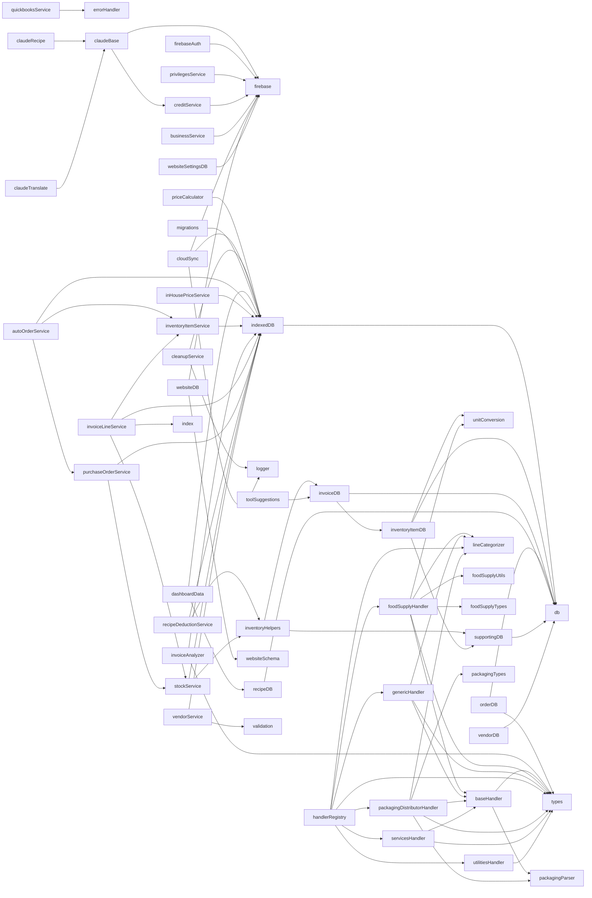

<!-- AUTO-GENERATED by codebase-mapper agent — do not edit manually -->
<!-- Generated: 2026-01-30T23:04:29.468Z -->

# System Map

Dependency graphs auto-generated from import analysis.

## Service Dependencies

Services and their internal dependencies.

## Page → Component Dependencies

Which components each page renders.

```mermaid
flowchart LR
  AccountingDashboardPage --> Card
  AccountingDashboardPage --> Button
  AccountingDashboardPage --> Badge
  AccountingDashboardPage --> Spinner
  AccountingDashboardPage --> Alert
  BackupTab --> Card
  BackupTab --> Button
  DepartmentsTab --> Card
  DepartmentsTab --> Button
  DepartmentsTab --> Badge
  DepartmentsTab --> Modal
  DepartmentsTab --> Input
  InventoryTab --> index
  OverviewTab --> Card
  OverviewTab --> Button
  OverviewTab --> Badge
  OverviewTab --> UserTaskList
  RecipesTab --> Button
  RecipesTab --> Badge
  UsersTab --> Card
  UsersTab --> Button
  UsersTab --> Badge
  UsersTab --> UserTaskList
  ControlPanelPage --> Badge
  ControlPanelPage --> Spinner
  ControlPanelPage --> PrivilegesModal
  ControlPanelPage --> EditAccountModal
  DatabaseTestPage --> Button
  DatabaseTestPage --> Card
  DatabaseTestPage --> Alert
  DepartmentTasksPage --> AssignTaskModal
  DepartmentTasksPage --> BulkTaskDictation
  FieldVariationPage --> Card
  FieldVariationPage --> Button
  ForgotPasswordPage --> Button
  ForgotPasswordPage --> Input
  ForgotPasswordPage --> Alert
  ForgotPasswordPage --> Card
  HeartbeatDashboardPage --> Card
  HeartbeatDashboardPage --> Button
  HeartbeatDashboardPage --> Spinner
  HeartbeatDashboardPage --> OrganismView
  ImageImportPage --> Button
  ImageImportPage --> Alert
  InHouseInvoicePage --> Button
  InHouseInvoicePage --> Card
  InHouseInvoicePage --> Input
  InHouseInvoicePage --> Alert
  InHouseInvoicePage --> Modal
  InvoiceListPage --> Button
  InvoiceListPage --> Card
  InvoiceListPage --> Alert
  InvoiceListPage --> Modal
  InvoiceListPage --> Input
  InvoiceListPage --> Badge
  InvoiceListPage --> Spinner
  InvoiceUploadPage --> Button
  InvoiceUploadPage --> Card
  InvoiceUploadPage --> Alert
  InvoiceUploadPage --> InvoiceLineList
  InvoiceUploadPage --> LineEditModal
  LandingPage --> index
  LandingPage --> Modal
  LandingPage --> Button
  LandingPage --> Input
  LoginPage --> Button
  LoginPage --> Input
  LoginPage --> Alert
  LoginPage --> Card
  LoginPage --> BusinessSetupWizard
  PDFImportPage --> Button
  PDFImportPage --> Card
  PDFImportPage --> Alert
  PDFImportPage --> Input
  RecipeEditorPage --> Input
  RecipeEditorPage --> Dropdown
  RecipeEditorPage --> Button
  RecipeEditorPage --> index
  RecipeEditorPage --> MethodSteps
  RecipeEditorPage --> PlatingInstructions
```

## Component/Page → Service Dependencies

Which services components and pages use for data.

```mermaid
flowchart LR
  AccountingSetupModal --> indexedDB
  AssignTaskModal --> privilegesService
  AssignTaskModal --> tasksService
  AssignTaskModal --> taskDependencyService
  AssignTaskModal --> indexedDB
  BusinessSetupWizard --> privilegesService
  BusinessSetupWizard --> businessService
  BusinessSetupWizard --> indexedDB
  CreditsDisplay --> creditService
  CreditsDisplay --> firebase
  EditAccountModal --> privilegesService
  EditAccountModal --> firebaseAuth
  EditAccountModal --> businessService
  OwnerSetupModal --> privilegesService
  PrivilegesModal --> privilegesService
  PrivilegesModal --> indexedDB
  PromotionModal --> websiteDB
  PromotionModal --> indexedDB
  InventoryDashboard --> inventoryItemService
  InventoryDashboard --> vendorService
  InventoryDashboard --> indexedDB
  InventoryDashboard --> inventoryHelpers
  InventoryDashboard --> autoOrderService
  InventoryDashboard --> businessService
  InventoryDashboard --> pdfExportService
  InventoryDashboard --> inHousePriceService
  InventoryItemAllFieldsModal --> invoiceDB
  InventoryItemDetail --> inventoryItemService
  InventoryListItem --> inventoryHelpers
  InvoiceLineItem --> lineCategorizer
  InvoiceLineList --> lineCategorizer
  LineEditModal --> lineCategorizer
  TrainingConsentModal --> settingsStorage
  OrderEditor --> types
  OrdersTab --> purchaseOrderService
  OrdersTab --> vendorService
  OrdersTab --> inventoryItemService
  OrdersTab --> businessService
  OrdersTab --> pdfExportService
  FixPriceModal --> invoiceDB
  FixPriceModal --> indexedDB
  IngredientLinkModal --> indexedDB
  IngredientLinkModal --> claudeTranslate
  IngredientLinkModal --> toolSuggestions
  IngredientList --> claudeAPI
  IngredientList --> settingsStorage
  IngredientList --> indexedDB
  IngredientRow --> priceCalculator
  IngredientRow --> toolSuggestions
  MethodSteps --> googleCloudVoice
  MethodSteps --> claudeAPI
  Notes --> googleCloudVoice
  Notes --> claudeAPI
  PackagingLinkModal --> indexedDB
  PlatingInstructions --> googleCloudVoice
  PlatingInstructions --> claudeAPI
  PlatingInstructions --> indexedDB
  WebsiteTab --> imageStorage
  BulkTaskDictation --> bulkTaskVoice
  BulkTaskDictation --> taskParser
  BulkTaskDictation --> tasksService
  UserTaskList --> privilegesService
  UserTaskList --> tasksService
  AddEditVendorModal --> vendorService
  VendorsTab --> vendorService
  WebsiteBuilder --> websiteSchema
  WebsiteBuilder --> websiteDB
  WebsiteBuilder --> imageStorage
  WebsiteSetupWizard --> websiteSettingsDB
  StepAbout --> websiteSchema
  StepAbout --> imageStorage
  StepBusinessType --> websiteSchema
  StepContact --> websiteSchema
  StepDesign --> websiteSchema
  StepGallery --> imageStorage
  StepIdentity --> imageStorage
  StepPromotions --> indexedDB
  StepReview --> websiteSchema
  StepSEO --> websiteDB
  AccountingDashboardPage --> indexedDB
```

## Circular Dependencies

_No circular dependencies detected._

---
*Auto-generated by codebase-mapper agent on 2026-01-30*
